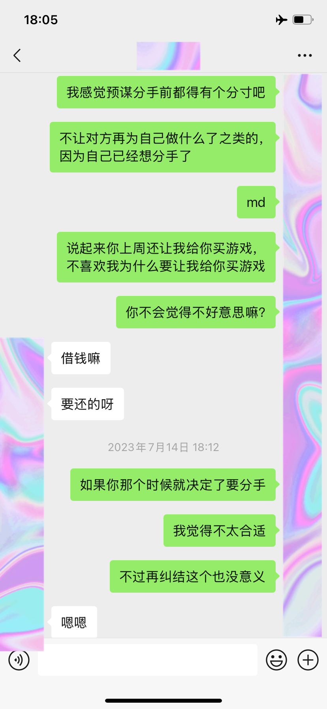
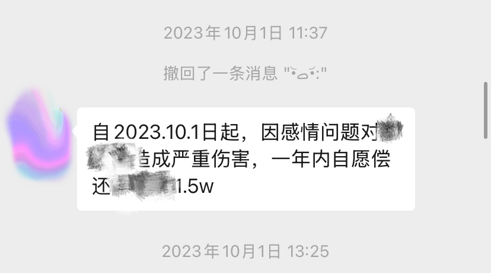
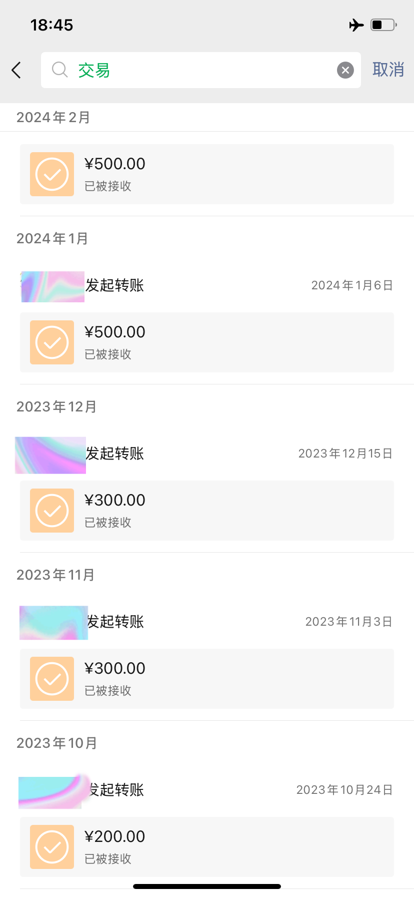
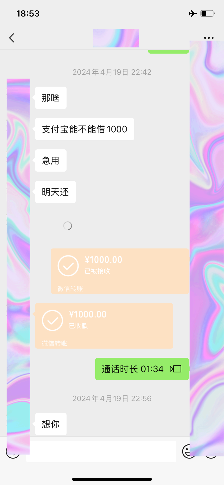
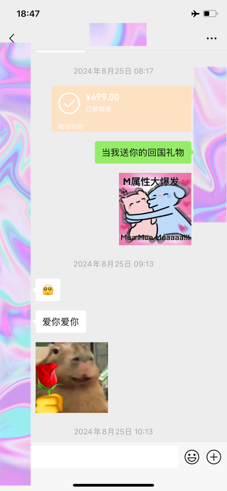
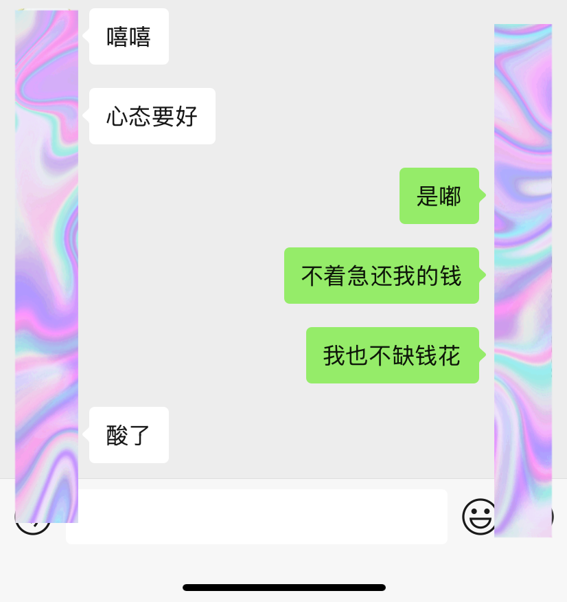
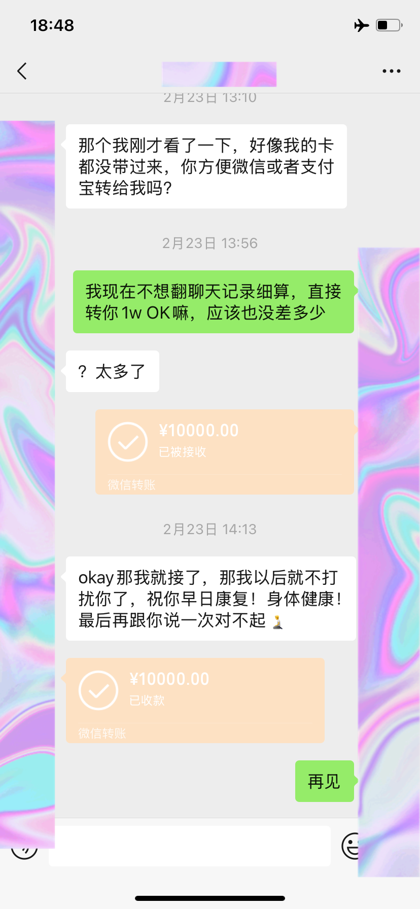
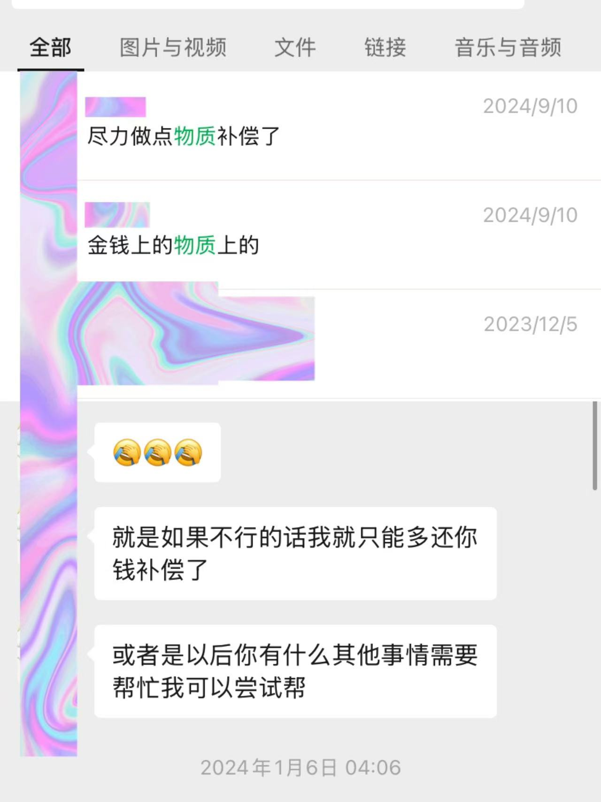

# bjtu-hkust-渣男专用贴

渣男简称为z。
本科毕业于bjtu计算机学院、目前博士就读于港科amc部。主要的恶劣行径包括多次出轨、与现女友确立关系后不还前女友钱、欺骗现女友等事。

## 1、关于恋爱的时间线快速梳理
先对我俩恋爱的时间线进行一个简单梳理，方便后续其他问题的说明以及读者理解。
```python
20年10月，z追求我、而后我与他确立恋爱关系；

23年6月，本科毕业，z与我回到郑州，我7月初回北京入职；

23年7月，z在我刚回北京工作后开始与一小学女同学频繁联系，同时冷处理我，质问后称感觉跟我在一起不合适，我答应分手；

23年9月，z对其表白失败，转而求我复合，我心软同意；

23年10月，国庆节我回郑州发现事实，再次分手；

23年年末，z再次提出复合，后再次对我冷暴力，称不合适要与我分手；

24年初， 据他现女友所述，z追求一小学女同学失败（不确定与23年7月的是否为同一人）；

24年4月，z再次找到我求复合，声称这么长时间不联系都是在考虑跟我的关系，深思熟虑后觉得非我不可，经过前面几次的欺骗，我没有立即同意，答应他看他表现给他一个机会；

24年4-8月，相处较为和谐，又一次不理智的答应了复合；

24年8月底，z回国在北京待了几天见同学，随后我请假跟他一起回郑州；

24年9月，也就是我回到北京后，z再次对我冷处理，同时追求他现女友并且确立恋爱关系，我们俩随后分手，这也是最后一次的彻底分手。
```

## 2、分手后关于钱的问题

重要的事情先说三遍
没要他补偿的钱‼️没要他补偿的钱‼️ 没要他补偿的钱‼️

感情中出轨的事情在1中已经叙述过了，2就讲一下我俩之前关于钱的事情。其实一共没多少钱，就几千块钱，多是在本科过程中借我的钱。

但整个分期还钱的过程也是有点儿离谱，虽然我这两天才意识到这个问题的离谱。我朋友，aka顶级起名天才，将z称之为 **劈腿欠款24期免息哥**。

23年7月第一次分手，z说要快点儿把欠我的钱还我，其实直到23年9月第一次找我复合前，1毛也没还。更离谱的是在他已经开始跟另外女生聊天的时候，还问我能不能送他一个游戏。
<p align="center">
  
</p>

23年10月国庆我发现他第一次出轨，争吵之后他说要多还我一些钱当做补偿。
<p align="center">
  
</p>

23年10月到24年3月，每个月都还了我一点儿。
<p align="center">
  
</p>

24年4月左右复合开始就没还了，哦，中间还借了我一千（第二天并没有还 笑死😁）。
<p align="center">
  
</p>

24年8月底见完面之后，他说能不能送他一个游戏手柄，当然他回国也给我带礼物了，此处为了说明事实大概率不是他所说得认识现任女友前就想要和我分手了，不然还让我送他手柄的话，就太难评了......
<p align="center">
  
</p>

24年10月，我生日，送了我一个apple watch，此时他跟他现女友在一起至少快一个月了。但这个表是他老早就说回国要送我的，并且他回国跟我在一起的那一周，在北京吃住、回郑州的高铁、在郑州吃住基本都是我出的钱，也有两千多了。我觉得从钱上来说，算是一个扯平的程度。

24年10月底，聊天的时候我说不着急还我的钱，反正我也不缺这点儿钱。但25年1月春节我开始寻思这人有点儿离谱吧，都分手这么久了，这次算彻底分手了，为啥一点儿钱都不还我？所以找他问了一回，过年当天和2月十几号还了我两次。
<p align="center">
  
  
</p>


接下来就到了25年2月我发现他上年又一次绿了我的时候，最终他转了我一万五，我把多的钱、他所谓要补偿我的钱又退回去了。
<p align="center">
  
</p>

在多次找我复合又因为各种原因冷暴力我分手的过程中，n次说要尽力在物质上弥补我。（没截全）
<p align="center">
  
</p>

啊啊啊啊啊啊啊啊啊我要疯了，我是什么活不起的人吗？这年头一万块钱就能玩弄我的感情了？别太荒谬了大哥！
## 3、离谱事件总结

此处再重点总结一下z除了出轨之外，非常非常没品的事情

**准备分手了还让我替他干活、送他游戏**
```python
据z后面所述，23年7月第一次提分手，是因为觉得我俩之间出现了不可调和的矛盾，属于早就预谋分手。

那我请问呢，既然你早就预谋分手。毕业前还让我帮你干这干那的怎么好意思？？？我给你写东西写到手腕疼，实习时候中午不睡觉还给你整理各种文件。然后临分手前还让我送你游戏又怎么好意思？？？真一点儿脸也不要？？？
```
**第一次出轨后出去玩，吃住让我出钱**
```python
我首先要承认我确实nc，23年10月，国庆节我发现他出轨后，10月中旬他就给我哄好了，哄好之后，我多次询问那我俩现在到底算什么关系，z都回答说好朋友关系。

就是这么个好朋友关系，他还约我去石家庄玩，我还抱着不切实际的希望屁颠屁颠就去了，然后除了他往返石家庄的车费，在石家庄的消费都是我出的钱！

我是有毛病，但你是不是太没品了？？？你明知道我为什么去，你把我当猴耍是吧，你怎么好意思让我出钱的？？？
```
**第二次出轨前，让我送他游戏手柄**
```python
虽然从时间线就已经能实锤24年9月他是认识现任女友后，立马对我冷暴力的，但按z解释说，他是回国与我相处几天后，觉得还不合适想要分手。

那我又要问了，既然你觉得不合适要分手，你为啥好意思让我送你手柄呢大哥？？？你又为啥好意思那几天都让我花钱呢？？？你做人底线就如此之低？？？
```
**说不想欺骗现女友**
```python
被我发现第二次出轨、并且被我拒绝私下处理后，开始急着跟我撇清关系、全网拉黑我，说什么我不能再欺骗我女朋友了。

恶心！你装什么纯情。

你俩恋爱开始不就是从你满嘴的谎言开始的？你说你在美国期间都单身，实则不是跟我在一起，就是在追你的小学同学。这个时候不想着在欺骗你女朋友了？

你俩谈上恋爱之后，也不知道你是出于什么考虑，不还是三天两天主动找我聊天关心我的情况，这个时候不想着在欺骗你女朋友了？

我发现你第二次出轨后，你还想和平解决，还说可以跟我接着做同学、做朋友，以后来北京或者我去深圳，要请我吃饭。这个时候又不想着在欺骗你女朋友了？
```

## 4、最后的一些想法
读者看完时间线后可能觉得我也很离谱，居然答应他那么多次复合。确实，我承认这一点，我做得最错的事情就是答应他多次复合，甚至发现他第一次出轨后，还傻傻的相信他后面几次提复合都是真诚的。不过你仗着我念旧、对你还有感情，多次把我当plan b，我该你的？你忘了一开始是你追的我，说暗恋我一年终于等我到分手能追我，那时候的纯情是不是也是装的？？？

然后也先解释一下为什么现在才说这个事情，24年9月中旬分手后，我为次患上抑郁症，至今未好（我抑郁这件事z从一开始就知情，也在跟他现女友在一起后，多次关心我的现状）。今年，也就是25年2月，因为大数据推送，刷到了z现女友的社交平台，这个时候才发现原来24年9月的那次分手，又是一次出轨，这个发现加重我的抑郁状态。经过很多天的心理斗争，决定在各个平台戳穿渣男纯情、靠谱面具下的真面目。

读者或许会觉得我极端、不体面，但是自从23年10月第一次发现他出轨、到25年2月发现他第二次出轨，这中间的一年零四个月，尽管无比痛苦、抑郁，但为了维护他的形象和面子，我从未对共同好友讲述过他的恶劣行径。直到现在，我才认识到，他从未把我当个有感情的人对待。既然他不把我当人看，也不要管我不给他留面子。

我发誓上面所述没有任何虚假、添油加醋。此恨绵绵无绝期，唯愿恶有恶报！

You had it coming！
